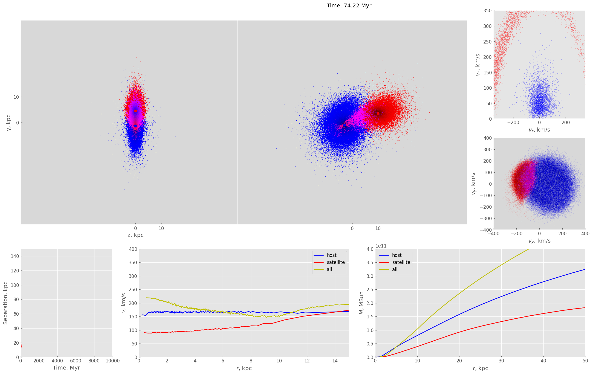

# Open Modeling Tool
## Description
OMT (Open Modeling Tool) is used to numerically solve and visualize N-body problem with huge number of particles. Primary application is galactic evolution. 

## Prerequisites
It requires following packages to work:
```bash
pip install numpy matplotlib pandas pyyaml amuse-framework argparse astropy
```
You also need to install [pyfalcon](https://github.com/GalacticDynamics-Oxford/pyfalcon) module which makes integration possible.

## Usage
Program has three modes: creation, integration and analysis:
### Creation
This module is responsible for initialization of snapshots. You can create [configuration YAML file](examples/creation_config.yaml) which describes list of objects in the snapshot (single objects and ```*.csv``` files are supported for now).

The output is single FITS file which has two HDUs: empty primary one (it is required by FITS standard) and binary table with positions, velocities and masses of each particle in the system. It also stores timestamp T = 0 in the header. 

You can start it with
```bash
python main.py create /path/to/config/file.yaml
```
### Integration
This module is responsible for actual integration of the model from previous module. It operates similarly: you create [configuration file](examples/integration_config.yaml) with all the data necessary. Next step is to launch 
```bash
python main.py integrate /path/to/config/file.yaml
```
It will print some info into console and gradually produce output FITS file. Each HDU of this file would contain timestamp in the ```TIME``` header and table with fields ```[x, y, z, vx, vy, vz, m]```. Be aware that depending on number of particles it can take quite a lot of disk space.
### Analysis
This module is responsible for the visualization of file with snapshots (for example, one from previous module). As always, you should create [configuration file](examples/analysis_config.yaml). The biggest part of it is description of matplotlib's plots layout. Launch command:
```bash
python main.py analize /path/to/config/file.yaml
```
If done right it should produce a lot of pictures (the same amount as number of timestamps in the input file) similar to this one: 




__This program is under heavy development so some things (or all of them) might work not as expected or not work at all.__